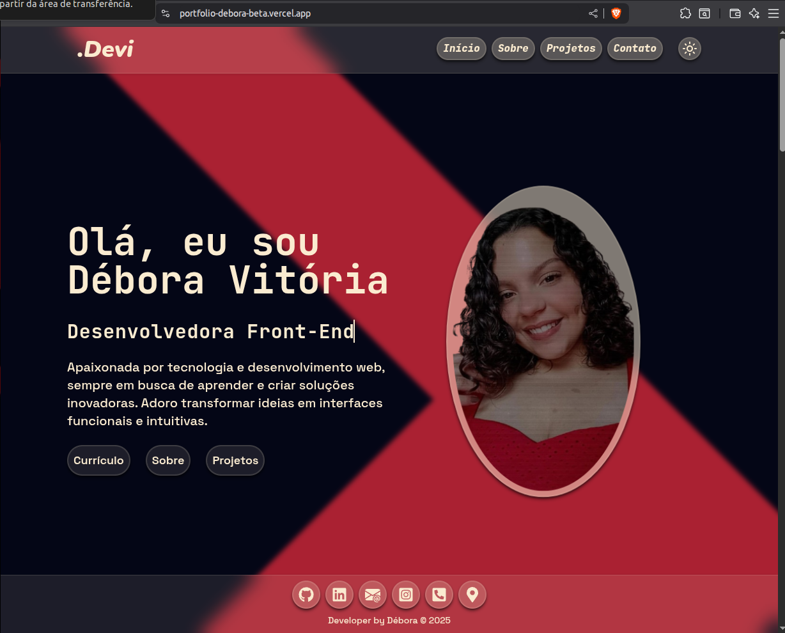
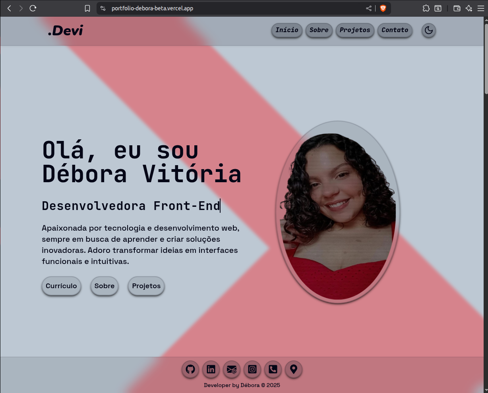

# 👩‍💻 Débora Vitória – Portfólio Front-End

## Preview

## Sobre Mim

Sou Débora Vitória, desenvolvedora front-end apaixonada por criar interfaces intuitivas e experiências digitais memoráveis. Busco transformar ideias em aplicações funcionais e visualmente incríveis, sempre aprendendo e evoluindo no universo do desenvolvimento web.

 - 🎯 Foco: Front-End / Full Stack
 - 💻 Tecnologias: HTML, CSS, JavaScript, React, Tailwind CSS, Bootstrap
 - 🌱 Aprendendo: Node.js, Express, TypeScript, PostgreSQL, MongoDB, Git Flow, Testes (Jest/Cypress)
 - 📚 Formação: Graduação em andamento (Conclusão: Junho/2025)

## Portfólio Pessoal

### Descrição: Meu próprio portfólio, projetado para mostrar meus projetos e habilidades.

#### Tecnologias: React, Framer Motion, Tailwind CSS
#### Status: Em desenvolvimento
#### Link: https://portfolio-debora-beta.vercel.app/

---

### Habilidades Técnicas

| Linguagens        | Frameworks / Bibliotecas     | Ferramentas / Outros      |
|-------------------|------------------------------|---------------------------|
| HTML / CSS        | React.js                     | Git / Git Flow            |
| JavaScript        | Tailwind CSS                 | VSCode                    |
| TypeScript        | Express                      | Figma                     |
| Node.js (básico)  | Framer Motion                | Vercel / Netlify          |
| SQL / NoSQL       | Bootstrap / Sass             | ESLint / Prettier         |

---

### Contato

Se você quer se conectar, conversar sobre oportunidades ou apenas bater um papo sobre tecnologia:

 - 📧 Email: dboravitoriasilva16@gmail.com
 - 💼 LinkedIn: https://www.linkedin.com/in/deboravsilva/
 - 🐙 GitHub: https://github.com/dboravitoria

---

## Mensagem Final

Sou movida pela curiosidade e paixão por desenvolvimento web. Cada projeto é uma oportunidade de aprender, superar desafios e entregar algo significativo. Estou aberta a colaborações e pronta para contribuir com projetos inovadores!

---